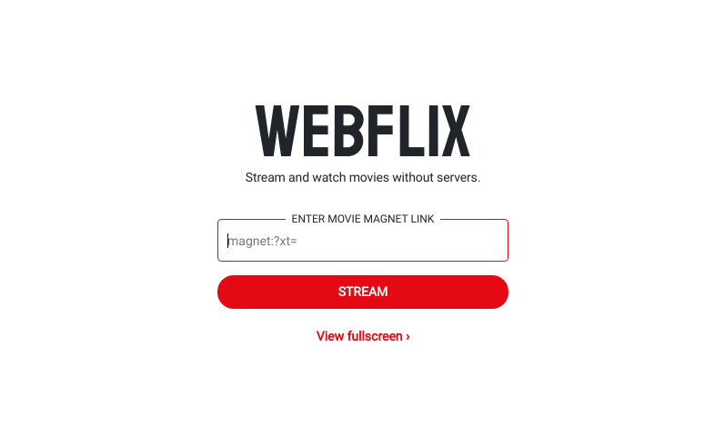

<p align="center">
  
  <br/>
  <strong>Webflix</strong>
</p>

## Demo

<p align="center">
  
  
</p>

## Dependencies

```bash
~$ make deps
```

## Build

1. Build **webflix.js** and **webflix.css** library:

```bash
~$ make webflix.css  # ./build
~$ make webflix.js   # ./build
```

2. Build browser extension:

```bash
~$ make chrome && make firefox  # ./build
```

## Chrome

```
~$ git clone https://github.com/syf-hackathon-team-gmdm/webflix.git
~$ cd webflix && make
```

1. Open Chrome and head to `chrome://extensions`.
2. Enable `Developer mode`.
3. Click `Load unpacked`.
4. Select `webflix/build/chrome-extension` directory.

## Example

> magnet:?xt=urn:btih:08ada5a7a6183aae1e09d831df6748d566095a10&dn=Sintel&tr=udp%3A%2F%2Fexplodie.org%3A6969&tr=udp%3A%2F%2Ftracker.coppersurfer.tk%3A6969&tr=udp%3A%2F%2Ftracker.empire-js.us%3A1337&tr=udp%3A%2F%2Ftracker.leechers-paradise.org%3A6969&tr=udp%3A%2F%2Ftracker.opentrackr.org%3A1337&tr=wss%3A%2F%2Ftracker.btorrent.xyz&tr=wss%3A%2F%2Ftracker.fastcast.nz&tr=wss%3A%2F%2Ftracker.openwebtorrent.com&ws=https%3A%2F%2Fwebtorrent.io%2Ftorrents%2F&xs=https%3A%2F%2Fwebtorrent.io%2Ftorrents%2Fsintel.torrent

## License

**webflix** is under [MIT License](./LICENSE).
